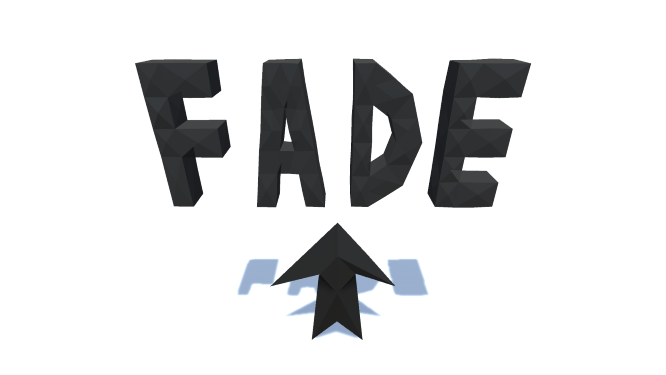
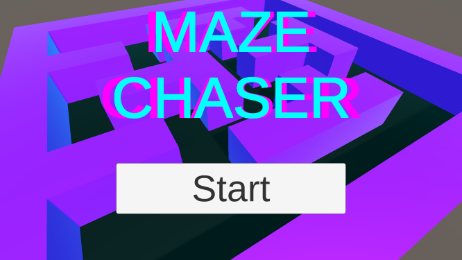
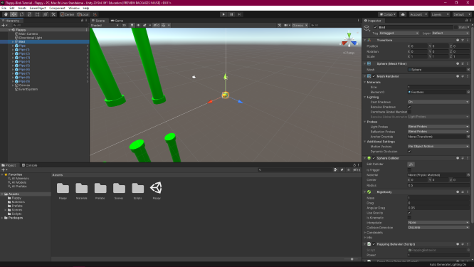

# Projects

## Fade

Gestalt is a platforming game about a moth trying to restore it wings.

* [Latest Release](https://team-forest.itch.io/gestalt)

## Maze Chaser

Maze Chaser is a simplistic game developed as an example for students. It uses no imported assets and is playable using mouse, keyboard, or gamepad, or touch screen.

* [Repository](https://github.com/vanPhelan/Maze-Chaser)

* [Web Player](https://vanphelan.github.io/Maze-Chaser/player/)

## Flappy Bird Tutorial

This is a beginner's tutorial for entry level Unity developers.

* [Repository](https://github.com/vanPhelan/Flappy-Bird-Tutorial)
